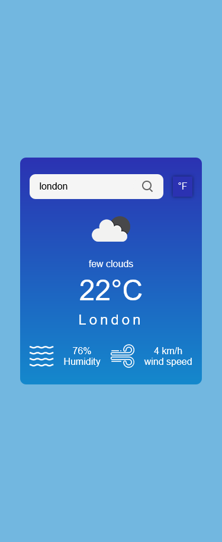
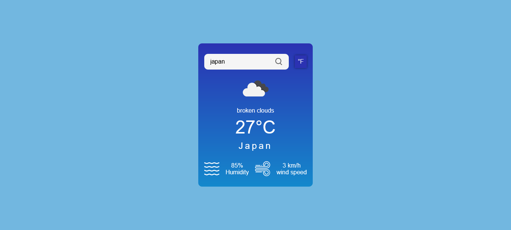
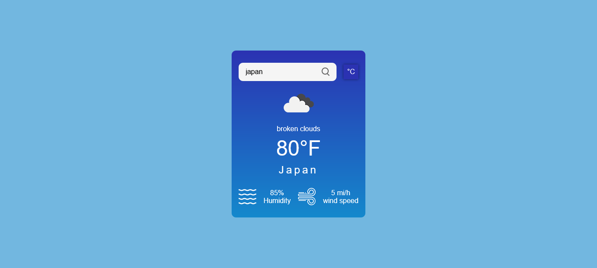

## Table of contents

- [Overview](#overview)
  - [The challenge](#the-challenge)
  - [Screenshot](#screenshot)
  - [Links](#links)
  - [Built with](#built-with)
  - [Continued development](#continued-development)
- [Author](#author)

## Overview

### The challenge

Users should be able to:

- Enter location (`City`, `State` or `Country`)
- View current temperature
- View weather description
- View icon representing the weather condition
- Toggle between `Celsius` and `Fahrenheit` temperature units
- View the optimal layout for the site depending on their device's screen size

### Screenshot

- Mobile Celsius

- Mobile Fahrenheit

- Desktop Celsius

- Desktop Fahrenheit

### Links

- Live Site URL: [@via Vercel](my-weatheraapp.vercel.app)
- Live Site URL: [@via Netlify](https://my-weatheraapp.netlify.app/)

### Built with

- [React](https://reactjs.org/) - JS library
- [Vite](https://vitejs.dev/) - Build tool
- [styled-components](https://styled-components.com/) - CSS for the <Component>
- React Hooks ( useState , useEffect )
- React custom hooks
- JSX syntax

### Continued development

Build more projects with Reactjs

## Author

- Website - [Ragaboga](https://github.com/RagaBoGaa)
